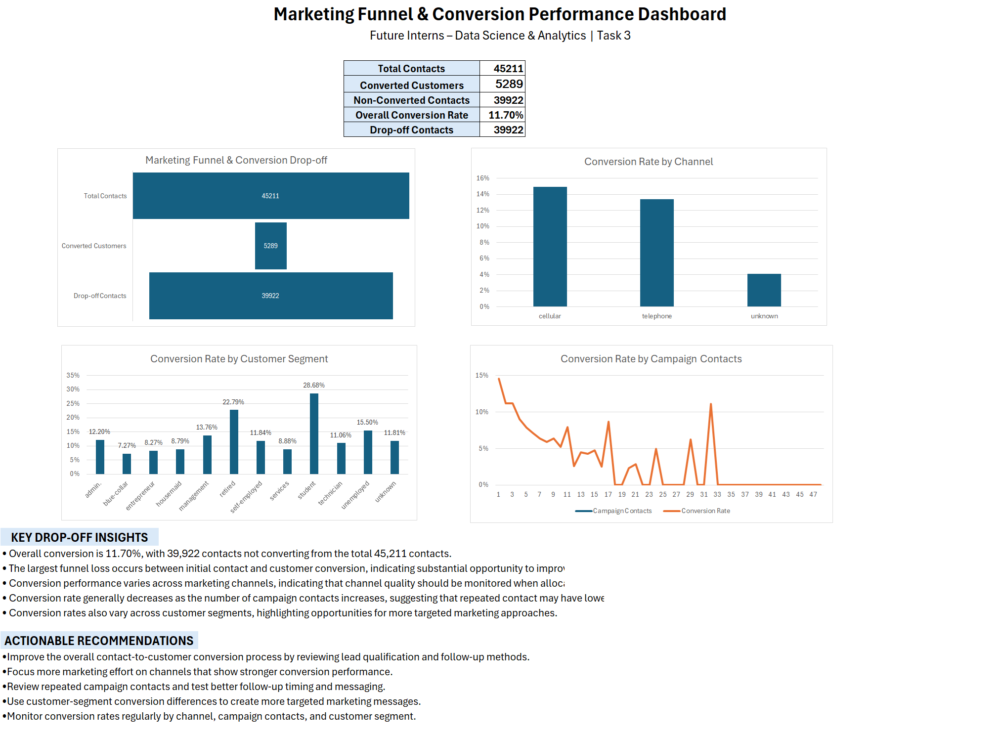

# FUTURE_DS_03
Marketing funnel and conversion analysis using Excel, including channel, campaign, customer segment, and drop-off analysis.
 
## Project Overview
 
This project was completed as part of the Future Interns Data Science & Analytics Internship.
 
The project focuses on analyzing marketing campaign data using Microsoft Excel. The analysis looks at customer conversion, marketing funnel drop-offs, channel performance, campaign contact patterns, previous campaign outcomes, and customer segments to understand conversion performance.
 
The final result is an Excel dashboard with key conversion metrics, charts, insights, and practical recommendations.
 
## Objectives
 
The main objectives of this project are:
 
- Calculate the overall customer conversion rate.
- Analyze the marketing funnel and identify major drop-off points.
- Compare conversion performance across marketing channels.
- Analyze conversion based on the number of campaign contacts.
- Analyze previous campaign outcomes.
- Compare conversion rates across customer segments.
- Identify areas where the conversion process can be improved.
- Provide practical recommendations for improving conversion performance.
 
## Tools Used
 
- Microsoft Excel
- Excel Tables
- PivotTables
- Data Cleaning
- Data Analysis
- Excel Formulas
- Charts and Data Visualization
- Excel Dashboard
 
## Dataset
 
The project uses a Bank Marketing dataset containing customer information and marketing campaign details.
 
The `y` field was used as the conversion outcome:
 
- `yes` – customer converted
- `no` – customer did not convert
 
Total records analyzed: 45,211
 
## Data Cleaning
 
The dataset was checked and structured before carrying out the analysis.
 
The following preparation steps were completed:
 
- Organized the marketing dataset in an Excel Table.
- Checked the available data fields before analysis.
- Used the conversion outcome field for identifying converted and non-converted customers.
- Prepared the data for PivotTable and dashboard analysis.
 
## Analysis Performed
 
### 1. Overall Conversion Analysis
 
The overall conversion performance was calculated from the marketing data.
 
- Total contacts: 45,211
- Converted customers: 5,289
- Non-converted contacts: 39,922
- Overall conversion rate: 11.70%
 
### 2. Marketing Funnel and Drop-off Analysis
 
The marketing funnel was analyzed using total contacts, converted customers, and non-converted contacts.
 
The analysis shows a large drop-off between the total number of contacts and the number of converted customers.
 
The dashboard was created to make this drop-off easier to understand.
 
### 3. Channel Analysis
 
Conversion rates were compared across the available marketing channels.
 
This analysis was used to identify differences in conversion performance between channels and to understand which channels were producing stronger conversion results.
 
### 4. Campaign Contact Analysis
 
The number of contacts made during the current campaign was compared with conversion rates.
 
The analysis generally showed lower conversion efficiency as the number of campaign contacts increased, although some individual contact levels showed variation.
 
### 5. Previous Campaign Analysis
 
Previous campaign outcomes were analyzed to understand how earlier customer interactions were related to the current conversion outcome.
 
### 6. Customer Segment Analysis
 
Conversion rates were compared across different customer job segments.
 
This analysis helped identify differences in conversion performance between customer groups and highlighted opportunities for more targeted marketing approaches.
 
## Key Insights
 
- The overall conversion rate is 11.70%, with 5,289 converted customers out of 45,211 contacts.
- 39,922 contacts did not result in conversion, showing a large overall funnel drop-off.
- Conversion performance varies across marketing channels.
- Conversion efficiency generally decreases as the number of campaign contacts increases.
- Conversion rates vary across different customer segments.
- The results show opportunities to improve the overall contact-to-customer conversion process.
 
## Practical Recommendations
 
Based on the observed patterns, the following actions can be considered:
 
- Focus more marketing effort on channels that show stronger conversion performance.
- Review repeated campaign contacts and improve follow-up timing and messaging.
- Use customer segment information to create more targeted marketing approaches.
- Improve the overall process from customer contact to conversion.
- Regularly monitor conversion rates across channels, campaign contacts, and customer segments.
 
## Dashboard
 
The Excel dashboard includes:
 
- Total Contacts
- Converted Customers
- Overall Conversion Rate
- Drop-off Contacts
- Marketing Funnel & Conversion Drop-off
- Conversion Rate by Channel
- Conversion Rate by Campaign Contacts
- Conversion Rate by Customer Segment
- Key Drop-off Insights
- Actionable Recommendations
 
### Dashboard Preview
 

 
## Project Files
 
The repository contains the following files:
 
## Project Files

- [Marketing_Funnel_Analysis.xlsx](./Marketing_Funnel_Analysis.xlsx) – Complete Excel analysis and dashboard.
- [Marketing_Funnel_Dashboard.png](./Marketing_Funnel_Dashboard.png) – Dashboard preview image.
- [README.md](./README.md) – Project documentation.
 
## Data Limitation
 
The dataset contains marketing contact and conversion information, but it does not provide separate website visitor and lead counts.
 
Therefore, this project focuses on the available contact-to-customer conversion data rather than creating separate visitor-to-lead and lead-to-customer metrics.
 
The campaign contact analysis also shows some variation at individual contact levels, so the observed overall trend should be interpreted together with the individual campaign-contact results.
 
## Conclusion
 
This project provides an Excel-based analysis of marketing conversion and funnel performance. The dashboard brings together important conversion metrics, funnel drop-off analysis, channel and campaign comparisons, customer segmentation, visualizations, and practical recommendations that can help improve marketing conversion performance.
